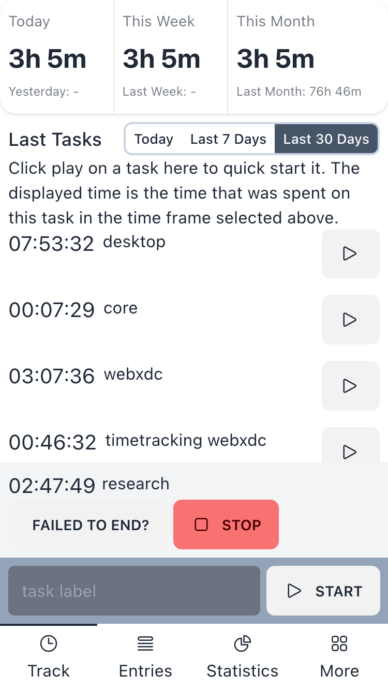
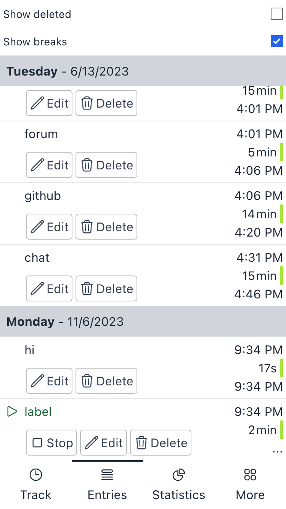
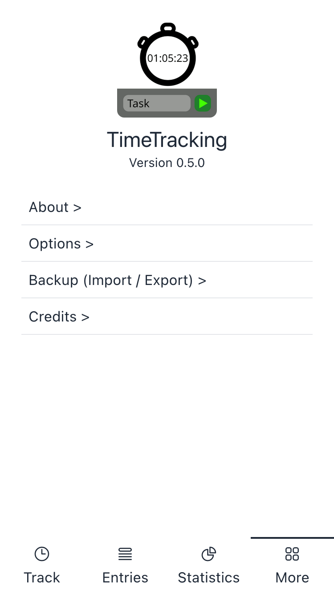

#  TimeTracking.xdc

| Track                                                            | Entries                                                              | Stats                                                                 | More                                                           |
| ---------------------------------------------------------------- | -------------------------------------------------------------------- | --------------------------------------------------------------------- | -------------------------------------------------------------- |
|  |  |  |  |

This is a simple timetracking webxdc app, it meant to be used by one user. Later there could be a fork of this app or a build flavor that supports multiple concurent users.

You can send it to youself in the saved messages and timetrack across multiple devices, if you use different accounts on your devices, you could make a group and use it there on all your devices.

It's timetracking on multiple devices, but without the need for a cloud.

## Developing

We use `yarn` as packagemanger, node version `18` and `prettier` for formatting. We recommend using a node version manager like [nvm](https://github.com/nvm-sh/nvm) or [fnm](https://github.com/Schniz/fnm).

Starting a live server to develop

```sh
yarn dev
```

Running unit test:

```sh
yarn unit-tests
```

Running all tests:

```sh
yarn test
```

Fix formatting:

```sh
yarn fix-formatting
```

Package as webxdc:

```sh
yarn build
```

### Making a new release

Bump the version with this command (it also creates a git tag)

```sh
yarn version --patch # or --minor or --major
git push && git push --tags
```

if you want you can also package it:

```sh
yarn build
```

you will find the `.xdc`-file it inside of `dist-zip/`.
